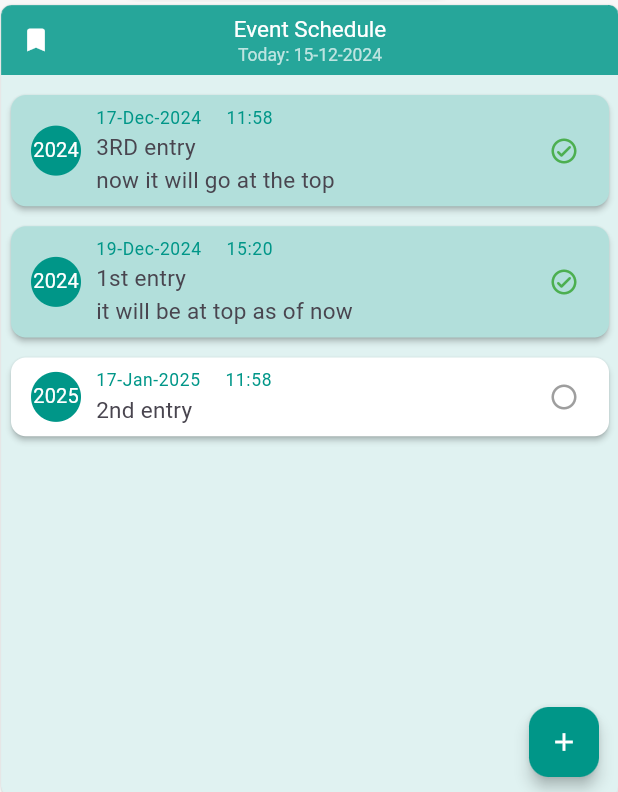
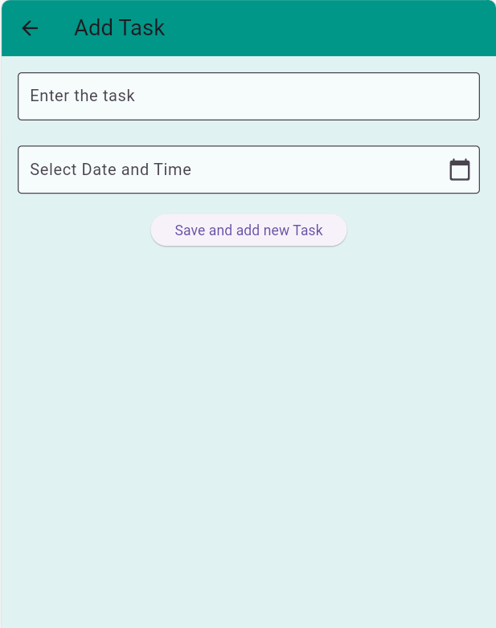

# Flutter Event/Task Scheduler App

A simple yet functional Flutter app for scheduling and managing tasks. Create tasks, set their date and time, and mark them as completed.

## Features

- **Task Creation:** Add tasks with descriptions and dates/times using an intuitive date-time picker.
- **Task Listing:** View tasks in a clean, organized list with descriptions, due dates, and completion status.
- **Task Status:** Task completion is indicated by an icon next to the task.
- **Task Completion:** Mark tasks as complete or incomplete via an alert dialog on long press.
- **User-Friendly Interface:** Clean, modern Material Design layout for easy use.
- **Customizable Task Cards:** Tasks are displayed in customizable cards for an enhanced UI.

## Screenshots

### Homepage

### Add Task Page

