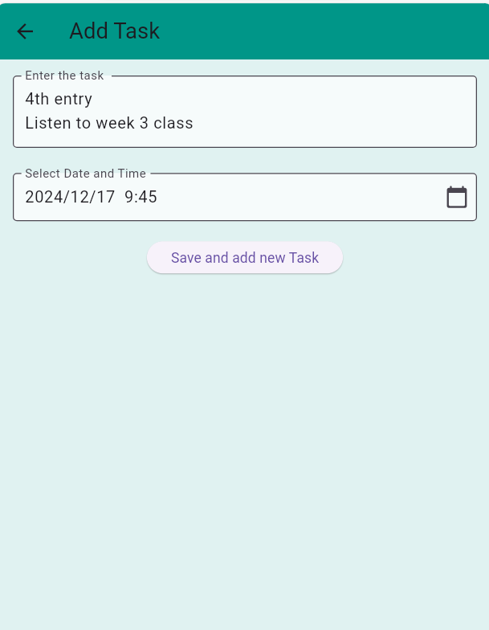

# Flutter Event/Task Scheduler App

A simple yet functional Flutter application for scheduling and managing events or tasks. This app allows users to create tasks, specify their date and time, and mark them as completed.

## Features

*   **Task Creation:** Users can add new tasks by providing a description and specifying a date and time using a convenient date and time picker.
*   **Task Listing:**  Tasks are displayed in a clear and organized list view, showing the task description, the due date and time, and their completion status.
*  **Task Status:** Task completion status is shown through an icon next to the task.
*   **Task Completion:** Users can mark tasks as complete or incomplete via an alert dialog which will be presented on long press on each task.
*   **User-Friendly Interface:** The app utilizes a clean and simple Material Design layout for an intuitive user experience.
*  **Customizable Task Card:** Each task is presented in a customizable card view for better UI.

## Screenshots

Here are some screenshots of the app:

### Homepage

### Add Task Page

### Add Task Page

