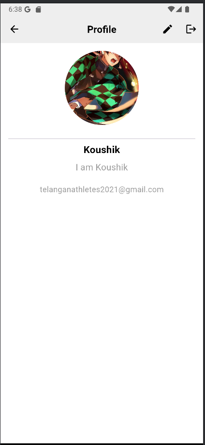

# News App - UI Design and Implementation

## Overview

This project is about designing and implementing the UI for a **News App**. The app will display articles, allow searching, saving articles, and show user profiles.

## Features

# My App - User Authentication and Profile Management

## Description
This is a Flutter app that allows users to log in using either their email/password or Google account. It provides functionality for accessing the Home page, searching content, saving content for later, and managing user profiles. The app also includes features to update and log out of the profile.

## Features
### 1. **User Authentication**
  - Users can log in with their email and password using Firebase Authentication.
  - Google Sign-In is also supported for a quicker login experience.

### 2. **Splash Screen**
  - Displays a logo when the app is launched, followed by navigation based on the user's login status.

### 3. **Navigation**
  - Smooth transition between pages such as Login, Home, Search, Profile, and Update Profile pages depending on user authentication status.

### 4. **Home Page**
  - The main content of the app is displayed here. It can show articles, news, or any other relevant content to the user.

### 5. **Search Page**
  - Users can search for content within the app using a search bar.

### 6. **Save Page**
  - Allows users to save articles or items for later viewing.

### 7. **Profile Page**
  - Displays user account information.
  - Includes a **Sign-Out** button for logging out of the app.

### 8. **Update Profile Page**
  - Users can update their personal details such as name, email, and profile picture.

## Screenshots
### SplashPage

### LoginPage

### Sign In

### Homepage

### Detail Page

### Search Page

### Saved Page

### Profile

### Update Profile Page

