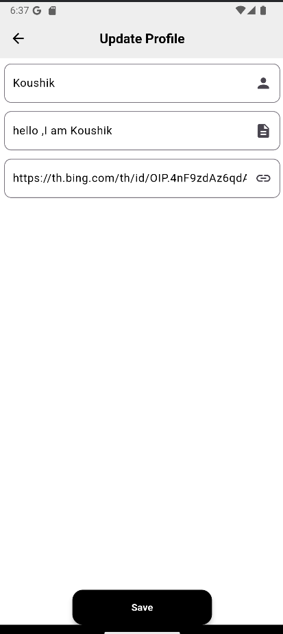

# News App - UI Design and Implementation

## Overview

This project is about designing and implementing the UI for a **News App**. The app will display articles, allow searching, saving articles, and show user profiles.

## Features

### 1. **Home Page**:
- Displays a list of articles with:
    - Title, source, time ago, thumbnail image, and author.
- Categories buttons (e.g., "Technology," "Sports," "Politics").
- Profile button to go to the Profile Screen.

### 2. **Bottom Navigation Drawer**:
- Navigation bar for **Home**, **Search**, and **Saved Articles**.

### 3. **Detail Screen**:
- Shows full article details when clicked, including:
    - Title, author, description, source, published date, and image.

### 4. **Profile Screen**:
- Displays user's info: profile picture, name, and bio.

### 5. **Search Screen**:
- A search screen with a **TextInput** field.

### 6. **Saved Articles Screen**:
- Screen for saved articles (empty for now).

## Screenshots
### SplashPage

### LoginPage

### Sign In

### Homepage

### Search Page

### Saved Page

### Profile

### Update Profile Page

